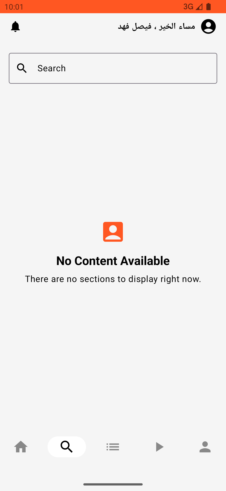
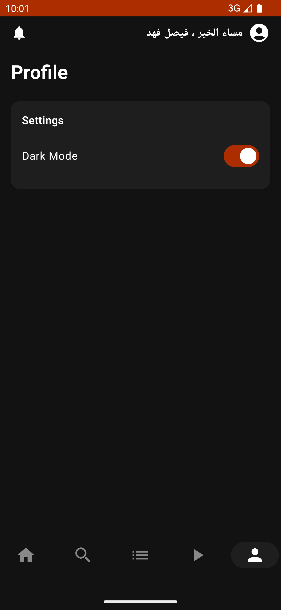
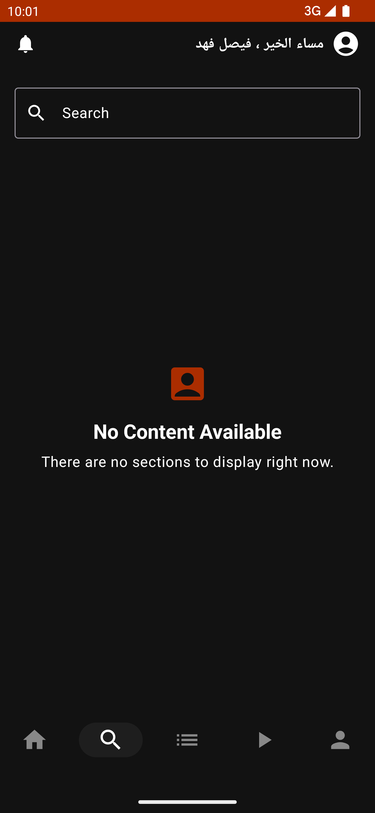
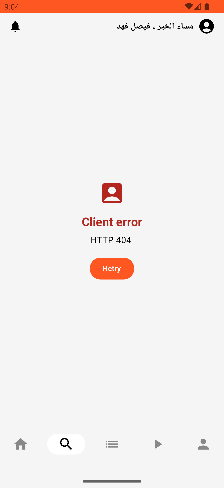

# ThmanyahTast

A modular, scalable Android application built with Kotlin, following Clean Architecture and MVI principles. The project leverages modern Android development tools and best practices to ensure maintainability, testability, and a robust user experience.

---

## Project Structure

```
project-root/
├── buildSrc/                     # Custom build logic, dependency management
│   └── src/main/kotlin/
│       └── Dependencies.kt       # Centralized dependency declarations
│
├── app/                          # Main application module
│   ├── build.gradle.kts
│   ├── proguard-rules.pro
│   ├── src/
│   │   ├── androidTest/
│   │   ├── main/
│   │   │   ├── data/             # Data layer (network, db, repository)
│   │   │   ├── domain/           # Domain layer (use cases, models)
│   │   │   ├── presentation/     # Presentation layer (UI, ViewModels)
│   │   └── test/
│   └── build.gradle
│
├── core/                         # Core module with shared functionality
│   ├── build.gradle.kts
│   ├── proguard-rules.pro
│   ├── src/
│   │   ├── androidTest/
│   │   ├── main/
│   │   │   ├── data/
│   │   │   ├── domain/
│   │   │   ├── presentation/
│   │   └── test/
│   └── build.gradle
│
├── feature-home/                 # Home feature module
│   ├── build.gradle.kts
│   ├── proguard-rules.pro
│   ├── src/
│   │   ├── androidTest/
│   │   ├── main/
│   │   │   ├── data/
│   │   │   ├── domain/
│   │   │   ├── presentation/
│   │   └── test/
│   └── build.gradle
│
├── feature-search/               # Search feature module
│   ├── build.gradle.kts
│   ├── proguard-rules.pro
│   ├── src/
│   │   ├── androidTest/
│   │   ├── main/
│   │   │   ├── data/
│   │   │   ├── domain/
│   │   │   ├── presentation/
│   │   └── test/
│   └── build.gradle
│
├── build.gradle.kts              # Project-level build script
├── settings.gradle.kts           # Project settings
├── gradle.properties             # Gradle properties
├── gradlew                      # Gradle wrapper script
└── gradlew.bat                  # Gradle wrapper script for Windows
```

---

## Tech Stack

- **Language:** Kotlin
- **Architecture:** MVI, Clean Architecture
- **UI:** Jetpack Compose
- **Dependency Injection:** Hilt
- **Async:** Coroutines, Flow
- **Networking:** Retrofit, OkHttp
- **Image Loading:** Coil
- **Testing:** JUnit, Mockk
- **Navigation:** Android Jetpack Navigation Component
- **Paging:** Paging3
- **Other:** ViewBinding, SharedPreferences

---

## Features

- Modularized app structure for scalability and maintainability
- Clean separation of concerns using Clean Architecture
- Reactive UI with Jetpack Compose
- Dependency injection with Hilt
- Asynchronous programming with Coroutines and Flow
- RESTful API consumption with Retrofit and OkHttp
- Efficient image loading with Coil
- Unit and instrumentation testing with JUnit and Mockk
- Paging support for large data sets
- Navigation handled by Jetpack's Navigation component
- Comprehensive error handling for server and network issues

---

## Enhancement Opportunities

- Add offline functionality to allow users to access the app without an internet connection
- Enable podcast streaming capabilities
- Increase test coverage for better reliability
- Add content filtering options on the home screen by type (e.g., Podcasts, Episodes)
- Enhance home screen design and overall user experience
- Integrate animations and visual effects for a more dynamic UI
- Establish a robust architectural foundation to support future scalability (current base is minimal due to project scope)

---

## Screenshots

| Home Screen | Detail Screen | Search Screen |
|-------------|--------------|---------------|
|  |  |  |
|  |  |  |

---

## Demo Video

https://github.com/Bakribrahim208/Thmanyah-Task/assets/main/Screen_recording_20250702_224117.mp4

---
